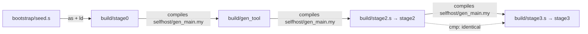

# Bootstrap

"Self-hosted" means: the compiler written in Myla, compiled by itself, produces itself again, byte for byte (D23).

[TOC]

## Stages

The bootstrap starts from a seed: the self-hosted compiler's own assembly for the machine it runs on, committed (D101, [[MYLA-218]]): `bootstrap/seed.s` on x86-64 Linux, `bootstrap/seed-aarch64.s` on aarch64 Linux (D127, [[MYLA-276]]). It needs only that machine's `as` and `ld`. Until the Python toolchain was retired ([[MYLA-219]]), it could build stage 1 instead (`--from-python`); see [[Development/Bootstrap#the-python-toolchains-last-state]].


```mermaid
flowchart LR
    seed["bootstrap/seed.s"] -->|"as + ld"| s0["build/stage0"]
    s0 -->|"compiles selfhost/gen_main.my"| g["build/gen_tool"]
    g -->|"compiles selfhost/gen_main.my"| s2["build/stage2.s → stage2"]
    s2 -->|"compiles selfhost/gen_main.my"| s3["build/stage3.s → stage3"]
    s2 -.->|"cmp: identical"| s3
```

| Stage | What runs | Time (4 cores, 2026-11-01, `74e97c8`) |
| --- | --- | --- |
| 0 | `as` + `ld` of `bootstrap/seed.s` into `build/stage0` | 0.7 s |
| 1 | `build/stage0 selfhost/gen_main.my lib > build/gen_tool.s`, then `as` + `ld` | 1.1 s to compile |
| 2 | `build/gen_tool selfhost/gen_main.my lib > build/stage2.s`, then `as` + `ld` | 1.1 s to compile |
| 3 | `build/stage2 selfhost/gen_main.my lib > build/stage3.s`, then `as` + `ld` | 1.1 s to compile |
| check | `cmp build/stage2.s build/stage3.s` | |

A seed older than the sources is an older compiler, which is why the check comes after stage 3: stage 1 is the current compiler as the old one compiled it, stage 2 the first one the current compiler compiled, and `stage2.s` and `stage3.s` are both the current compiler's output. Bootstrapping today's sources from the seed of the commit before [[MYLA-237]] (a code-generation change) reaches the same fixed point, byte for byte.

The result is about 6.2 MB of assembly and a 1.5 MB static binary; the whole script, with `build/myla` and the language server, takes about 7.5 s from the seed (measured on 2026-11-01 at `74e97c8`). A fourth round produces the same output again.

## The seed

`bootstrap/seed.s` is the compiler of a fixed point, under a header that names the commit it came from and the SHA-256 of the assembly below it. It is the stage 3 compiler's output built without the embedded standard library: `seed_compile` in [[scripts/host.sh]] compiles a copy of `selfhost/` with an empty `embedded_std.my`, in a directory of its own beside a link to `lib/` and by the same relative paths ([[MYLA-431]]; before [[MYLA-552]] it put the empty file in the working tree while it ran). Stage 0 never reads the library it would embed, since the bootstrap gives every stage `lib/`, and the stages it builds embed the whole library again, so the fixed point and every tool are unchanged; the library as byte lists was half of each seed (x86-64 19.6 MB to 9.8 MB, aarch64 32.1 MB to 22.3 MB, 2026-11-10). A seed is therefore a compiler for the bootstrap only: it needs `lib/` to compile anything. `scripts/update-seed.sh` makes it: it runs the bootstrap from the current seed and writes the new seed. A seed that can no longer compile the sources is updated in steps: an older compiler builds a newer one (Git history), or, as for the first seed, the Python toolchain of `backup/python-toolchain-final` builds stage 1. Git shows it collapsed and without diffs (`.gitattributes`). `scripts/update-seed.sh` first checks every module of `lib/std` on its own (`build/myla check lib/std/<module>.my --stdlib lib`, about a second for the 59, 2026-11-12, `835132e`): a program reads a module's bodies only once it calls them, so a broken body nothing calls passes the bootstrap and would be carried by the seed and the embedded library ([[MYLA-416]], [[MYLA-552]]).

- **When to update it:** only when it can no longer bootstrap the sources (D207, [[MYLA-629]]; D156 updated it in every pull request). A seed older than the sources is an older compiler, and the fixed point proves what it built (above), so it stays until the compiler or the standard library starts using something it doesn't know: a primitive, a runtime variable, an attribute. Then the branch stages it: a commit of the compiler's side, a `Stage:` commit that runs `scripts/update-seed.sh` (about 8 s, 2026-11-01, `e0f2ceb`) and commits `bootstrap/seed.s` and `bootstrap/seed-aarch64.s`, then the use. `scripts/bootstrap.sh` and `scripts/check-seed.sh` say so when the seed fails to build the sources. CI's bootstrap jobs check each seed on its own machine: `bootstrap` the x86-64 one, `bootstrap-arm64` the aarch64 one. `selfhost/embedded_std.my`, which the bootstrap writes from `lib/`, is committed with every change to `lib/std/` and must be current.
- **The seeds of every master commit:** on a push to master, CI's bootstrap jobs upload that commit's seeds for every target (`scripts/update-seed.sh --out DIR`, which leaves `bootstrap/` alone) and each machine's `myla` and `myla-lsp` (a tarball, which keeps the executable bit) as workflow artifacts, kept 90 days, the most a public repository allows (D207). They are what a release will publish; the seeds a commit bootstraps from stay committed, since artifacts expire and need a token to download.
- **What a seed costs:** a version adds about 433 KB (x86-64) and 991 KB (aarch64) to the packed history; nothing but the latest seed is needed to bootstrap. Its labels are named by their function, string or constant, not counted over the program ([[MYLA-552]], [[Architecture/Native-backend]]), so a seed differs from the last only where the compiler's code changed: for the last change of round 6's wave 2 (34 lines in four files) 728 lines of the x86-64 seed instead of 5,146 and 1,863 of the aarch64 seed instead of 8,001, which a pack holding the last seed stores in 4.1 KB instead of 35.6 KB and 7.5 KB instead of 66.1 KB (`git gc --aggressive`). The functions' names in their labels (D196) made the seeds 17 % and 10 % bigger than the counted labels did (12.9 MB and 27.8 MB, 2026-11-13); the hashes first built for them, 3.8 % and 2.3 %. In the week before D156 a seed per commit (153 x86-64 and 44 aarch64 versions in six days) made 110 of the pack's 117 MB ([[Project/Review-2026-11]]); one per pull request (D156) kept the chain of seeds at a small fraction of that, and one only when needed (D207) keeps it smaller still, the chain still each compiled by the one before.
- **The optional pre-push hook:** `scripts/install-hooks.sh` sets `core.hooksPath` to `.githooks/`, whose `pre-push` runs `scripts/check-seed.sh` (about 6 s, 2026-11-01, `e0f2ceb`) when the commits pushed change `selfhost/`, `lib/std/` or the seed. A seed that can't bootstrap the sources, or a stale embedded library, stops a push to `master` or `main`; on another branch it is a reminder (`MYLA_SKIP_SEED_CHECK=1 git push` skips the check once). It checks the working tree, so commit first.
- **What it doesn't limit:** the seed only has to compile the compiler. What the compiler emits for programs (new system calls, IPC, a C FFI, other backends and platforms) is the compiler's business, not the seed's.
- **The first seed:** commit 74e97c8 (2026-11-01, [[MYLA-218]]) added `bootstrap/seed.s`, the fixed point of the sources at a2f95ba, whose stage 1 the Python toolchain of `backup/python-toolchain-final` (d94f948, tagged `python-toolchain-final`) built; the SHA-256 of its assembly is `7202f99a1d0031add5c0962830e0d2d5dd5b84a9142b701ee07dc07c7237d045`. Every later seed was compiled by the one before, so the chain goes back to a compiler that wasn't Myla's own.
- **Checking a seed:** run `scripts/update-seed.sh` at the commit its header names and compare; the compiler is deterministic, so the result is the same byte for byte.
- **Other machines** (D127, [[MYLA-276]]): `scripts/bootstrap.sh` (`just bootstrap`) finds the machine with `uname -m` ([[scripts/host.sh]]) and takes its seed: `bootstrap/seed.s` on x86-64, `bootstrap/seed-aarch64.s` on aarch64, such as a Raspberry Pi 4 or 5 with a 64-bit OS or an ARM server. It assembles and links the seed with that machine's GNU `as` and `ld` (binutils; nothing else). The tools it builds target the machine by default (`std.platform.TARGET`, which each target's platform module defines), so `build/myla build x.my` makes an aarch64 program there, through the same `as` and `ld`; another target takes `--target` and clang with lld. 32-bit ARM (`armv7l`) and other systems stop with a message.
- **Both seeds from one machine:** `scripts/update-seed.sh` writes every seed. Each is the stage 3 compiler's output for its target (without the embedded library), which is what that machine's own fixed point gives, byte for byte, as the compiler is deterministic and behaves the same on every target. `scripts/check-seed.sh` bootstraps from this machine's seed and reports, for each seed, whether it is also this compiler's output for its target (not required, D207). CI's `bootstrap-arm64` job runs `just bootstrap` from the aarch64 seed on GitHub's arm64 runner, which proves that seed builds the sources, and compares every example built there with the interpreter; its `targets` job runs the suites under qemu.
- **Another machine's bootstrap, emulated:** `MYLA_ARCH=aarch64 AS=aarch64-linux-gnu-as LD=aarch64-linux-gnu-ld MYLA_RUN=qemu-aarch64 scripts/bootstrap.sh build-a64` runs the aarch64 bootstrap on x86-64 (binutils-aarch64-linux-gnu and qemu-user); it reaches the same fixed point in about 75 s (2026-11-04, `8070d5d`).

The burn tests bootstrap from the seed too (`tests/burn/_tools.py`, [[MYLA-235]]), and CI's `bootstrap` job runs without Python, checks that the seed is current, and builds and runs an example with `build/stage3`.

## Why it used to be slow

Until October 2026 the bootstrap took about 5 minutes. Neither slow stage was slow because of Python or because the compiler is big; each had one hot spot:

| Stage | Before | Cause | After |
| --- | --- | --- | --- |
| 1 | about 60 s | 98% in `_collect_list_types`, which re-walked the type graph for every AST node ([[MYLA-60]]) | 3.4 s |
| 2 | about 4 min | the Python backend's allocator scanned one free list on every allocation ([[MYLA-16]]) | 1.3 s |

Both fixes left `stage2.s` byte-identical. A full bootstrap now takes about 8 seconds, so "change the compiler, bootstrap, compare" is an interactive loop.

## Running it

```bash
scripts/bootstrap.sh [OUT_DIR]       # default ./build, from bootstrap/seed.s
scripts/update-seed.sh               # a new seed from the current sources, only when needed (see "The seed")
scripts/update-seed.sh --out DIR     # the seeds of the current sources into DIR (CI's artifacts)
scripts/check-seed.sh [build]        # does the seed bootstrap the sources? (CI and the pre-push hook)
scripts/install-hooks.sh             # the optional pre-push hook for this clone
just bootstrap                       # the same
```

After the fixed point, the script also builds `build/myla` (from `selfhost/main.my`), the command-line tool (`run`, `test`, `build`, `check`, `repl`, and the project commands, [[Architecture/Project-tool]]), and `build/myla-lsp` (from `tools/lsp/main.my`), the language server. Its `build` runs `as` and `ld` itself through `std.process.run` and removes the intermediate `.s` and `.o` files; `run` passes the arguments after the file to the program:

```bash
build/myla build examples/hello.my -o build/hello && build/hello
build/myla run examples/args/main.my one two
build/myla test examples/traits.my
```

The tools carry the standard library ([[MYLA-243]]): before stage 1, stage 0 builds `tools/embed/main.my`, which writes `selfhost/embedded_std.my` from `lib/` (each file's text as a string literal, and each module's parse, which the loader reads instead of parsing the file, [[MYLA-412]], [[Architecture/Module-loader]]) when it changed, so every stage carries the same library and `build/myla` is never older than `lib/` after a bootstrap. The module is committed, so editors see whole sources; `test_embedded_std.py` fails when it isn't what `lib/` gives. `--stdlib <dir>` or `MYLA_STDLIB` name a directory instead (the repository's `lib/` while changing std, without bootstrapping).

## Using the self-hosted compiler directly

```bash
build/stage3 program.my lib > program.s     # the second argument is the folder holding std/
as --64 -o program.o program.s && ld -o program program.o
```

Without the second argument the root is derived from the compiler's location, as for `build/myla`. `scripts/build.sh <file> [out]` wraps this and works from any directory; `build/myla run <file> [args]` interprets a program.

## The Python toolchain's last state

The branch `backup/python-toolchain-final` on GitHub (commit d94f948, 2026-11-01) keeps the last state with the whole Python toolchain as stage 1 and test oracle, before the committed seed ([[MYLA-218]]) and the Python toolchain's retirement ([[MYLA-219]], D101): all suites green, the bootstrap at its fixed point, `MYLA_TEST_BACKEND=python` running the burn tests on the Python backend. To bring the Python toolchain back, start from there (`git checkout backup/python-toolchain-final -- src/myla myla.py`, or a branch from it).

## When the fixed point breaks

The fixed point is a strong check of the self-hosted code generator: any change in `selfhost/` that changes generated code changes `stage2.s`, and stage 3 must reproduce it. If `cmp` fails, the script prints the first differences. Typical causes are output that depends on iteration order, and a code-generation bug that makes the compiler one stage built behave differently from the one the next stage built.
